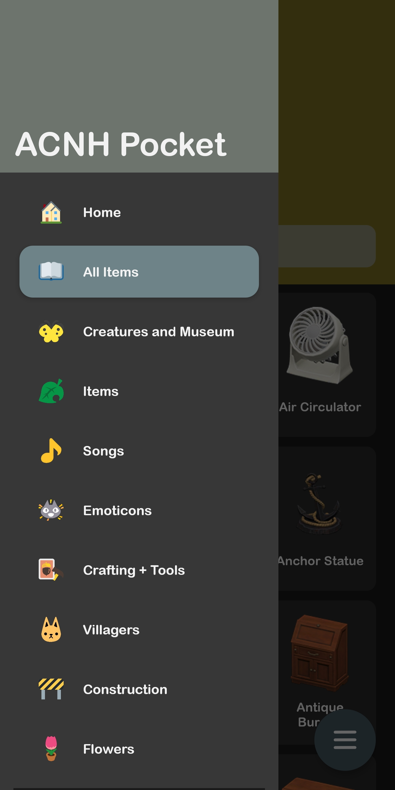
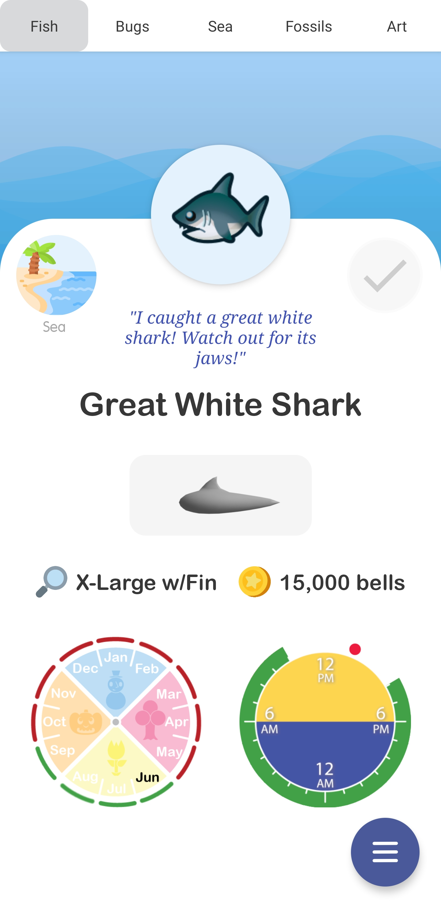

<h1 align="center" style="font-size:28px; line-height:1"><b>ACNH Pocket Guide</b></h1>


<div align="center" style="font-size:18px">

| 150K+ Downloads | 4K+ Reviews | 4.9+ Stars |
| :---: | :---: | :---: |

</div>

<a href="https://play.google.com/store/apps/details?id=com.acnh.pocket_guide">
  <div align="center">
    
  </div>
</a>
<a href="https://play.google.com/store/apps/details?id=com.acnh.pocket_guide">
  <div align="center">
    
  </div>
</a>


With a modern and well polished design, ACNH Pocket Guide is the best guide for tracking your collection as you progress through the game. View information on collectibles and creatures, as well as upcoming in game events. With the latest game information, this is the one stop for all your ACNH needs!

## Motivation
This application is a rewrite of the <a href=https://github.com/jameskokoska/AnimalCrossingNH-App>original</a> from scratch in React Native.

The goal of this rewrite is to make a more modular application that can be updated easier. The original app written in Flutter had various bugs relating to asynchronous function calls, reactive component layouts, and lacked a modular design with much repetitive code. After learning ReactJS, this project was started.

Since this application is written in React Native, support for an iOS app is possible but untested.

Many applications already existing provide a lack of features and intuitive UI layouts. I wanted to create a free application with no advertisements to create a pleasant user experience.

## Languages and Translations
All translations have been created from the help of volunteers listed within the application.

The list of translations can be seen here: https://docs.google.com/spreadsheets/d/1ZslDgBkPNj2kBDnSLFNl7FIFCX3_R29UMCVoC_WuzOM/edit?usp=sharing

## Install and Run Application Locally
This application uses Expo and React Native. Install expo. Navigate into the ```animal_crossing_app``` folder (using ```cd .\animal_crossing_app\```) repositories root location. Then install dependencies using ```npm install```. After installing packages use ```npm start``` or ```expo start```. Open the Expo development application on android device and connect through the localhost on the local network.

## Technical Features
- Components for modular programming
- Read and save information to local storage
- Read information from large JSON database efficiently
- Easily change attributes of data to display with modular component arguments
- Optimization of lists views and database access
- Classes and functions to allow for modular programming page design
- UI planning for intuitive user flow in Adobe XD
- Responsive design and layout for different screen zoom levels (set in the operating system's settings)
- Preloads databases before application run to memory
- Automatically pre-generate filter definitions with developer setting based on data
- Filter definitions and filter definition generation during run time or read from pre-generated data (for efficiency)
- Multiple language support
- Cloud backups and user account creation using Firebase RTDB
- All data backup and restore
- Cache images during runtime to allow efficient scrolling
- Multiple island profiles
- Customize event notifications
- Custom collection lists
- Custom app global time setting offset

## Features
- Dark mode
- Modern and polished interface and design
- Unique animations
- Intuitive gesture actions and UI layout
- Upcoming events list + Villager birthdays
- Calendar and events list and visuals
- Event notifications
- Store hours
- Wishlist and custom collection lists
- Islander info profile
- Real vs Fake art
- Recipes and ingredients lists
- DIY recipe sources
- Active creatures list
- Creature tracking + fish shadows
- Museum collection tracking and art guide
- Villager information
- Furniture, Clothing, Flooring, Wallpaper collections
- Slider song collection
- Song player for Aircheck, Live, and Music Box songs
- Emoticon collection
- Construction tasks and costs
- Flower hybrids guide
- Gyroid collection
- New and recently collected items
- TV schedule
- Achievements
- Paradise planning checklist
- Everything/All items page
- Filtering items
- Searching items
- Global searching
- Hide images to prevent spoilers setting
- 24 hour time
- Custom time, for time travelling
- Haptic feedback configuration
- Materials page
- Letters page
- Loan tracking
- Catalog Scanning with `nook.lol` integration
- Profile home screen page
- Amiibo card collection
- Cloud backups using Firebase RTDB
- Auto backups to Firebase RTDB
- Island user profiles
- MeteoNook and FAQ Guide integration
- TurnipProphet integration
- ... and more!

## Screenshots
Can be seen here: https://play.google.com/store/apps/details?id=com.acnh.pocket_guide or below
|   |  |  |
| ------------- | ------------- | ------------- |
|   |  |  |
|   |  |  |
