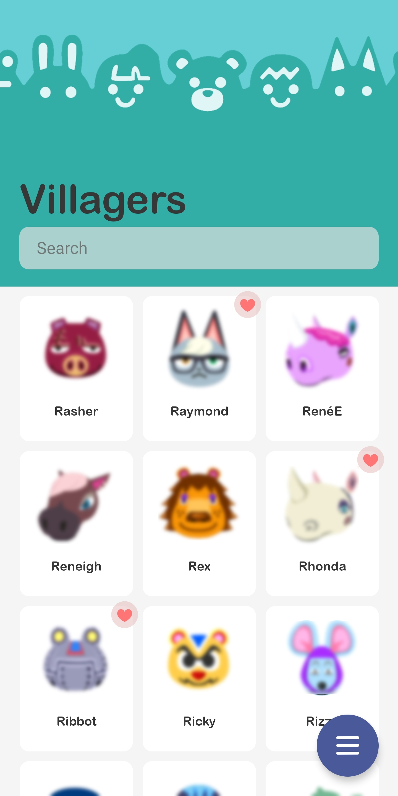

# ACNH Pocket Guide (React Native)
Rewrite of the original app from scratch in React Native.
The goal of this rewrite is to make a more modular application that can be updated easier. The original app written in Flutter had various bugs relating to asynchronous function calls, reactive component layouts, and lacked a modular design with much repetitive code. After learning ReactJS, this project was started to learn React Native.

## Release
https://play.google.com/store/apps/details?id=com.acnh.pocket_guide

## Technical Features
- Read and save information
- Read information from JSON database efficiently
- Optimization of lists views and database access
- Classes and functions to allow for modular programming page design
- UI planning done all in Adobe XD, see UI assets/ folder
- Loads stored data before application run
- Automatically pre-generate filter definitions with developer setting based on data

## Features
- Dark mode
- Modern and polished interface and design
- Upcoming events list + Villager birthdays and Store Hours
- Real vs Fake art
- Recipes and ingredients lists
- DIY recipe sources
- Active creatures list
- Creature tracking + fish shadows
- Museum collection tracking and art guide
- Villager information
- Furniture, Clothing, Flooring, Wallpaper collections
- Slider song collection
- Emoticon collection
- Construction tasks and costs
- Flower hybrids guide
- Filters
- 24 hour time, haptics settings 

## Screenshots
Can be seen here: https://play.google.com/store/apps/details?id=com.acnh.pocket_guide or below
|   |  |  |
| ------------- | ------------- | ------------- |
|   |  |  |
|   |  |  |